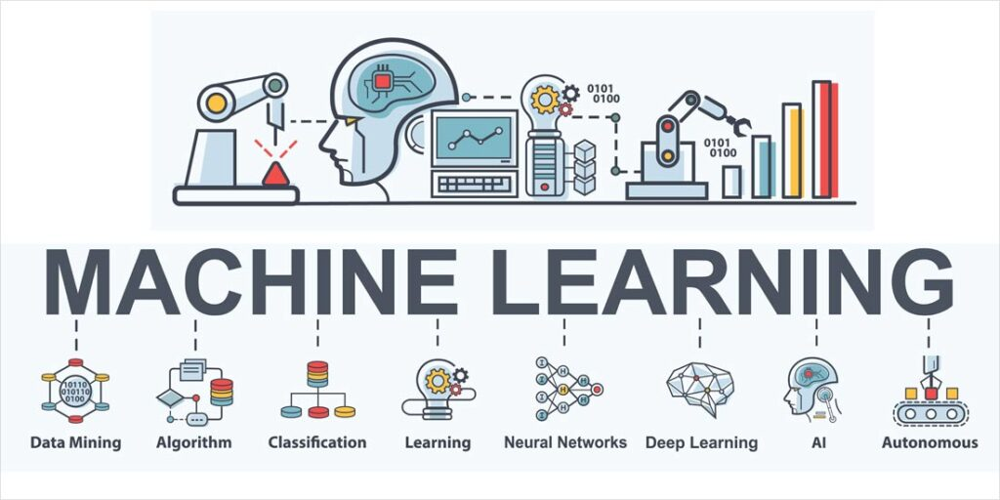

# INDE-577--Data-Science-and-Machine-Learning--Spring-2024-

This repository is made as a final project of graduate-level course, INDE 577, taught by Dr. Randi Davilla. It covers the fundamentals of Data Science and Machine Learning. It is design in a way to help students learn from scratch.  

 **Image source:** [Inside Big data](https://insidebigdata.com/2024/03/25/the-data-disconnect-a-key-challenge-for-machine-learning-deployment/)

### Data Science (DS)
Data Science encompasses a broader field that involves collecting, cleaning, analyzing, and interpreting data to extract insights and inform decision-making. It combines elements from statistics, machine learning, data engineering, data visualization, and domain knowledge to create comprehensive solutions.

**Key Concepts in Data Science**:
- **Data Collection and Cleaning**: Gathering data from various sources and preparing it for analysis.
- **Exploratory Data Analysis (EDA)**: Investigating data to understand its characteristics, trends, and relationships.
- **Statistical Analysis**: Using statistical techniques to analyze data and draw conclusions.
- **Machine Learning**: Applying machine learning algorithms to make predictions or classifications.
- **Data Visualization**: Creating charts, graphs, and visualizations to communicate insights.
- **Big Data**: Working with large and complex datasets that require specialized tools and technologies.

### Machine Learning (ML)
Machine Learning is a subset of artificial intelligence (AI) that involves developing algorithms and models that allow computers to learn from data and make decisions or predictions without being explicitly programmed to do so.

**Key Concepts in Machine Learning**:
- **Supervised Learning**: The model is trained on labeled data, meaning it has input-output pairs (like features and corresponding labels). Common algorithms include linear regression, logistic regression, decision trees, random forests, and neural networks.
- **Unsupervised Learning**: The model learns from unlabeled data by identifying patterns or structures. Examples include clustering (like k-means) and dimensionality reduction (like PCA).
- **Reinforcement Learning**: The model learns through a system of rewards and penalties by interacting with an environment.
- **Deep Learning**: A subset of machine learning involving neural networks with many layers, often used for complex tasks like image and speech recognition.

**Applications of Machine Learning**:
- Image and speech recognition
- Natural language processing (NLP)
- Recommendation systems
- Fraud detection
- Predictive analytics
- Self-driving cars

### Relationship between ML and DS
Machine Learning is an essential component of Data Science. While Data Science covers the entire process from data collection to insight generation, Machine Learning focuses on developing algorithms and models to analyze data and make predictions. Data Science often relies on Machine Learning to build predictive models and extract actionable insights from large datasets.

## Course Description 

The Course **Data Science and Machine learning** offered during the Spring 2024 semester at Rice University. 

**Topics include:** Introduction to scikit-learn, Keras and tensorflow2, linear and logistic regression, clustering, support vector machines, random forest trees, neural networks, deep learning, natural language processing. 

Files in this repository are Jupyter Notebook projects demonstrating machine learning algorithms learned in class and referenced in various textbooks. This repository primarily contains supervised learning algorithms and unsupervised learning algorithms.

## Content

The following is the list of algorithms developed and discussed in this repository

### Supervised Learning

1. [Perceptron](https://github.com/vkr93/Data-Science-and-Machine-Learning-INDE-577---Spring-2024-/tree/main/Supervised%20Learning/1_perceptron)
2. [Gradient Descent](https://github.com/vkr93/Data-Science-and-Machine-Learning-INDE-577---Spring-2024-/tree/main/Supervised%20Learning/2_Gradient%20Descent)
3. [Single Neuron Linear Regression](https://github.com/vkr93/Data-Science-and-Machine-Learning-INDE-577---Spring-2024-/tree/main/Supervised%20Learning/3_Single%20Neuron%20Linear%20Regression)
4. [Logistic Regression](https://github.com/vkr93/Data-Science-and-Machine-Learning-INDE-577---Spring-2024-/tree/main/Supervised%20Learning/4_Logistic_Regression)
5. [Deep Neural Network](https://github.com/vkr93/Data-Science-and-Machine-Learning-INDE-577---Spring-2024-/tree/main/Supervised%20Learning/5_%20Deep%20Neural%20Network)
6. [K-Nearest Neighbors](https://github.com/vkr93/Data-Science-and-Machine-Learning-INDE-577---Spring-2024-/tree/main/Supervised%20Learning/6_K_Nearest%20Neighbors)
7. [Decision Trees](https://github.com/vkr93/Data-Science-and-Machine-Learning-INDE-577---Spring-2024-/tree/main/Supervised%20Learning/7_Decision%20Trees)
8. [Ensemble Learning](https://github.com/vkr93/Data-Science-and-Machine-Learning-INDE-577---Spring-2024-/tree/main/Supervised%20Learning/8_Ensemble%20Random%20Forest)

### Unsupervised Learning

1. [K-means Clustering](https://github.com/vkr93/Data-Science-and-Machine-Learning-INDE-577---Spring-2024-/tree/main/Unsupervised%20Learning/1_K_means_Clustering)
2. [DBSCAN Clustering](https://github.com/vkr93/Data-Science-and-Machine-Learning-INDE-577---Spring-2024-/tree/main/Unsupervised%20Learning/2_DBSCAN)
3. [Principal Component Analysis](https://github.com/vkr93/Data-Science-and-Machine-Learning-INDE-577---Spring-2024-/tree/main/Unsupervised%20Learning/3_Principal%20Component%20Analysis)

### Datasets

All datasets used in this work are publically available. The source and description of each dataset used is provided within the respective model.

### Tools and Packages 

Python, Visual Studio Code, Jupyter Nootbooks, Scikit-learn, TensorFlow, Keras, Matplotlib, Numpy, Pandas, Seaborn.

### About the Author

Vinod is 2nd year Ph.D. student in the department of Materials Science and Nanoengineering at Rice University. His primarily research interest are in 2D catalysis for clean energy and environment. To know more about authod: [Google Scholar](https://scholar.google.com/citations?user=iCQ1b-MAAAAJ&hl=en&authuser=1) [LinkedIN](https://www.linkedin.com/in/vkr93/)

**References** 
* [Javapoint](https://www.javatpoint.com/machine-learning)
* [IBM Machine Learning](https://www.ibm.com/topics/machine-learning)
* [Hands on Machine Learning](https://www.oreilly.com/library/view/hands-on-machine-learning/9781492032632/) 
